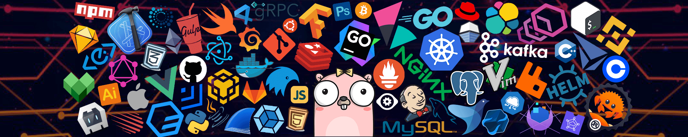

### console.log("Hi")

### 💻 Skills

| TS | JS | React | Redux | SASS | HTML | CSS |
|----------|----------|----------|-----|-----|-----|-----|
|   |  |  |  |  |  |   | 

| NestJS | NodeJS | Express | Postgres | Mongo | 
|----------|----------|----------|-----|-----|
|   |  |  |  |  | 

### 🌐 Socials

